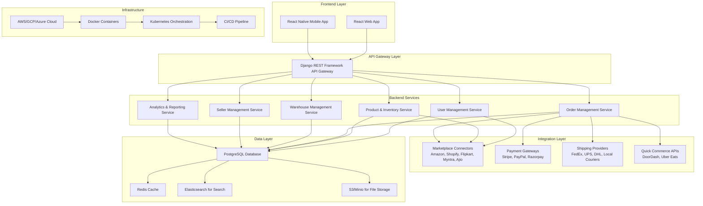

# E-Commerce System Architecture Design

## Overview
This document outlines a comprehensive system architecture for an e-commerce platform incorporating Warehouse Management, D2C (Direct-to-Consumer), Omni-Channel Retail, Inventory Management, Mobile App, Multichannel Order Management, Payment Reconciliation, Shipping Integration, Seller Management, Dashboard & Reports, Marketplace Integration, and Quick Commerce Integration. The architecture uses React for the frontend and Django/Python for the backend, ensuring scalability, security, and adherence to modern web app best practices.

## System Architecture Diagram


## Database Models

### Core Models
```python
# models.py (Django)

from django.db import models
from django.contrib.auth.models import AbstractUser

class User(AbstractUser):
    user_type = models.CharField(max_length=20, choices=[
        ('admin', 'Admin'),
        ('seller', 'Seller'),
        ('customer', 'Customer'),
        ('warehouse_staff', 'Warehouse Staff')
    ])
    phone = models.CharField(max_length=15, blank=True)
    address = models.TextField(blank=True)

class Product(models.Model):
    sku = models.CharField(max_length=100, unique=True)
    name = models.CharField(max_length=255)
    description = models.TextField()
    price = models.DecimalField(max_digits=10, decimal_places=2)
    category = models.ForeignKey('Category', on_delete=models.CASCADE)
    brand = models.CharField(max_length=100)
    images = models.JSONField()  # Array of image URLs
    attributes = models.JSONField()  # Size, color, etc.
    is_active = models.BooleanField(default=True)
    created_at = models.DateTimeField(auto_now_add=True)
    updated_at = models.DateTimeField(auto_now=True)

class Category(models.Model):
    name = models.CharField(max_length=100)
    parent = models.ForeignKey('self', null=True, blank=True, on_delete=models.CASCADE)
    description = models.TextField(blank=True)

class Inventory(models.Model):
    product = models.ForeignKey(Product, on_delete=models.CASCADE)
    warehouse = models.ForeignKey('Warehouse', on_delete=models.CASCADE)
    quantity = models.PositiveIntegerField(default=0)
    reserved_quantity = models.PositiveIntegerField(default=0)
    low_stock_threshold = models.PositiveIntegerField(default=10)
    last_updated = models.DateTimeField(auto_now=True)

class Warehouse(models.Model):
    name = models.CharField(max_length=100)
    address = models.TextField()
    manager = models.ForeignKey(User, on_delete=models.SET_NULL, null=True)
    capacity = models.PositiveIntegerField()
    is_active = models.BooleanField(default=True)

class Order(models.Model):
    order_number = models.CharField(max_length=50, unique=True)
    customer = models.ForeignKey(User, on_delete=models.CASCADE)
    status = models.CharField(max_length=20, choices=[
        ('pending', 'Pending'),
        ('confirmed', 'Confirmed'),
        ('processing', 'Processing'),
        ('shipped', 'Shipped'),
        ('delivered', 'Delivered'),
        ('cancelled', 'Cancelled'),
        ('refunded', 'Refunded')
    ])
    total_amount = models.DecimalField(max_digits=10, decimal_places=2)
    shipping_address = models.TextField()
    billing_address = models.TextField()
    payment_method = models.CharField(max_length=50)
    shipping_method = models.CharField(max_length=50)
    created_at = models.DateTimeField(auto_now_add=True)
    updated_at = models.DateTimeField(auto_now=True)

class OrderItem(models.Model):
    order = models.ForeignKey(Order, on_delete=models.CASCADE)
    product = models.ForeignKey(Product, on_delete=models.CASCADE)
    quantity = models.PositiveIntegerField()
    unit_price = models.DecimalField(max_digits=10, decimal_places=2)
    total_price = models.DecimalField(max_digits=10, decimal_places=2)

class Seller(models.Model):
    user = models.OneToOneField(User, on_delete=models.CASCADE)
    business_name = models.CharField(max_length=100)
    business_address = models.TextField()
    tax_id = models.CharField(max_length=50)
    commission_rate = models.DecimalField(max_digits=5, decimal_places=2, default=0.10)
    is_verified = models.BooleanField(default=False)

class MarketplaceIntegration(models.Model):
    name = models.CharField(max_length=100)  # Amazon, Shopify, etc.
    api_key = models.CharField(max_length=255)
    api_secret = models.CharField(max_length=255)
    base_url = models.URLField()
    is_active = models.BooleanField(default=True)
    last_sync = models.DateTimeField(null=True, blank=True)

class MarketplaceProduct(models.Model):
    product = models.ForeignKey(Product, on_delete=models.CASCADE)
    marketplace = models.ForeignKey(MarketplaceIntegration, on_delete=models.CASCADE)
    external_id = models.CharField(max_length=100)
    sync_status = models.CharField(max_length=20, choices=[
        ('synced', 'Synced'),
        ('pending', 'Pending'),
        ('failed', 'Failed')
    ])
    last_sync = models.DateTimeField(null=True, blank=True)

class PaymentTransaction(models.Model):
    order = models.ForeignKey(Order, on_delete=models.CASCADE)
    amount = models.DecimalField(max_digits=10, decimal_places=2)
    currency = models.CharField(max_length=3, default='USD')
    gateway = models.CharField(max_length=50)
    transaction_id = models.CharField(max_length=100)
    status = models.CharField(max_length=20, choices=[
        ('pending', 'Pending'),
        ('completed', 'Completed'),
        ('failed', 'Failed'),
        ('refunded', 'Refunded')
    ])
    created_at = models.DateTimeField(auto_now_add=True)

class Shipment(models.Model):
    order = models.ForeignKey(Order, on_delete=models.CASCADE)
    tracking_number = models.CharField(max_length=100)
    carrier = models.CharField(max_length=50)
    status = models.CharField(max_length=20, choices=[
        ('pending', 'Pending'),
        ('in_transit', 'In Transit'),
        ('delivered', 'Delivered'),
        ('returned', 'Returned')
    ])
    shipped_at = models.DateTimeField(null=True, blank=True)
    delivered_at = models.DateTimeField(null=True, blank=True)
```

## API Endpoints

### Authentication Endpoints
- `POST /api/auth/login/` - User login
- `POST /api/auth/register/` - User registration
- `POST /api/auth/logout/` - User logout
- `POST /api/auth/refresh/` - Refresh JWT token

### Product Management
- `GET /api/products/` - List products
- `POST /api/products/` - Create product
- `GET /api/products/{id}/` - Get product details
- `PUT /api/products/{id}/` - Update product
- `DELETE /api/products/{id}/` - Delete product
- `GET /api/products/search/` - Search products

### Inventory Management
- `GET /api/inventory/` - Get inventory levels
- `PUT /api/inventory/{id}/` - Update inventory
- `POST /api/inventory/adjust/` - Adjust inventory (in/out)
- `GET /api/inventory/low-stock/` - Get low stock alerts

### Order Management
- `GET /api/orders/` - List orders
- `POST /api/orders/` - Create order
- `GET /api/orders/{id}/` - Get order details
- `PUT /api/orders/{id}/status/` - Update order status
- `POST /api/orders/{id}/cancel/` - Cancel order

### Warehouse Management
- `GET /api/warehouses/` - List warehouses
- `POST /api/warehouses/` - Create warehouse
- `GET /api/warehouses/{id}/` - Get warehouse details
- `PUT /api/warehouses/{id}/` - Update warehouse
- `GET /api/warehouses/{id}/inventory/` - Get warehouse inventory

### Seller Management
- `GET /api/sellers/` - List sellers
- `POST /api/sellers/` - Register seller
- `GET /api/sellers/{id}/` - Get seller details
- `PUT /api/sellers/{id}/` - Update seller profile
- `GET /api/sellers/{id}/products/` - Get seller's products

### Marketplace Integration
- `GET /api/marketplaces/` - List connected marketplaces
- `POST /api/marketplaces/connect/` - Connect marketplace
- `POST /api/marketplaces/{id}/sync/` - Sync data with marketplace
- `GET /api/marketplaces/{id}/products/` - Get marketplace products
- `POST /api/marketplaces/{id}/push/` - Push product data to marketplace
- `POST /api/marketplaces/{id}/bulk-push/` - Bulk push data to marketplace

### Dashboard & Reports
- `GET /api/dashboard/summary/` - Get dashboard summary
- `GET /api/reports/sales/` - Sales reports
- `GET /api/reports/inventory/` - Inventory reports
- `GET /api/reports/orders/` - Order reports
- `GET /api/analytics/performance/` - Performance analytics

### Payment & Shipping
- `POST /api/payments/process/` - Process payment
- `GET /api/payments/{id}/` - Get payment details
- `POST /api/shipments/create/` - Create shipment
- `GET /api/shipments/{id}/` - Get shipment details
- `PUT /api/shipments/{id}/track/` - Update tracking

## React Component Structure

### Core Components
```
src/
├── components/
│   ├── common/
│   │   ├── Header.js
│   │   ├── Sidebar.js
│   │   ├── Footer.js
│   │   ├── LoadingSpinner.js
│   │   ├── ErrorBoundary.js
│   │   └── Notification.js
│   ├── auth/
│   │   ├── LoginForm.js
│   │   ├── RegisterForm.js
│   │   └── ForgotPassword.js
│   ├── dashboard/
│   │   ├── Dashboard.js
│   │   ├── SalesChart.js
│   │   ├── InventoryChart.js
│   │   └── RecentOrders.js
│   ├── products/
│   │   ├── ProductList.js
│   │   ├── ProductCard.js
│   │   ├── ProductForm.js
│   │   ├── ProductDetails.js
│   │   └── ProductSearch.js
│   ├── inventory/
│   │   ├── InventoryTable.js
│   │   ├── InventoryForm.js
│   │   ├── LowStockAlert.js
│   │   └── StockAdjustment.js
│   ├── orders/
│   │   ├── OrderList.js
│   │   ├── OrderDetails.js
│   │   ├── OrderForm.js
│   │   ├── OrderStatusUpdate.js
│   │   └── OrderTracking.js
│   ├── warehouses/
│   │   ├── WarehouseList.js
│   │   ├── WarehouseForm.js
│   │   ├── WarehouseDetails.js
│   │   └── WarehouseMap.js
│   ├── sellers/
│   │   ├── SellerList.js
│   │   ├── SellerProfile.js
│   │   ├── SellerOnboarding.js
│   │   └── SellerDashboard.js
│   ├── marketplaces/
│   │   ├── MarketplaceList.js
│   │   ├── MarketplaceConnect.js
│   │   ├── MarketplaceSync.js
│   │   ├── MarketplaceProducts.js
│   │   └── DataPushControls.js
│   ├── reports/
│   │   ├── SalesReport.js
│   │   ├── InventoryReport.js
│   │   ├── OrderReport.js
│   │   └── CustomReport.js
│   └── mobile/
│       ├── MobileHeader.js
│       ├── MobileSidebar.js
│       └── MobileProductCard.js
├── pages/
│   ├── Home.js
│   ├── Products.js
│   ├── Inventory.js
│   ├── Orders.js
│   ├── Warehouses.js
│   ├── Sellers.js
│   ├── Marketplaces.js
│   ├── Reports.js
│   └── Settings.js
├── hooks/
│   ├── useAuth.js
│   ├── useProducts.js
│   ├── useOrders.js
│   ├── useInventory.js
│   └── useMarketplaces.js
├── services/
│   ├── api.js
│   ├── authService.js
│   ├── productService.js
│   ├── orderService.js
│   └── marketplaceService.js
├── utils/
│   ├── constants.js
│   ├── helpers.js
│   └── validators.js
├── context/
│   ├── AuthContext.js
│   └── AppContext.js
├── App.js
├── index.js
└── styles/
    ├── global.css
    ├── theme.js
    └── components.css
```

## Integration Points

### Marketplace Integrations
- **Amazon**: SP-API for product listings, orders, inventory sync
- **Shopify**: REST API for store management, product sync
- **Flipkart**: Seller API for catalog management, order processing
- **Myntra**: Vendor API for product uploads, order management
- **Ajio**: Similar to Myntra, vendor portal integration

### Data Sync Capabilities
- **Real-time Data Viewing**: APIs to fetch live data from marketplaces
- **Individual Push**: Push single product/order updates
- **Bulk Push**: Batch operations for multiple items
- **Sync Status Tracking**: Monitor sync success/failure
- **Conflict Resolution**: Handle data discrepancies between systems

### Payment Gateways
- Stripe, PayPal, Razorpay integration
- Webhook handling for payment confirmations
- Reconciliation reports for payment matching

### Shipping Providers
- FedEx, UPS, DHL APIs for label generation, tracking
- Local courier integrations
- Automated shipment creation from orders

### Quick Commerce
- DoorDash, Uber Eats APIs for instant delivery
- Real-time availability checks
- Order routing to nearest fulfillment centers

## Scalability & Security

### Scalability Features
- **Microservices Architecture**: Modular backend services
- **Database Sharding**: Horizontal scaling for large datasets
- **Caching Layer**: Redis for frequently accessed data
- **CDN Integration**: For static assets and media files
- **Load Balancing**: Distribute traffic across multiple instances
- **Auto-scaling**: Based on CPU/memory usage

### Security Measures
- **JWT Authentication**: Secure token-based auth
- **Role-based Access Control**: Granular permissions
- **API Rate Limiting**: Prevent abuse
- **Data Encryption**: At rest and in transit
- **Input Validation**: Sanitize all user inputs
- **CSRF Protection**: For web forms
- **HTTPS Only**: Enforce secure connections
- **Audit Logging**: Track all system activities

### Best Practices
- **RESTful API Design**: Consistent endpoint structure
- **Versioning**: API versioning for backward compatibility
- **Error Handling**: Comprehensive error responses
- **Logging & Monitoring**: ELK stack for observability
- **Testing**: Unit, integration, and E2E tests
- **Documentation**: Swagger/OpenAPI specs
- **CI/CD Pipeline**: Automated deployment
- **Containerization**: Docker for consistent environments
- **Orchestration**: Kubernetes for production deployment

## Deployment Architecture

### Development Environment
- Local Docker setup with docker-compose
- Hot reloading for React development
- Django development server

### Production Environment
- Containerized deployment on Kubernetes
- Multi-region deployment for high availability
- Database replication and backups
- Monitoring with Prometheus/Grafana
- Log aggregation with ELK stack

This architecture provides a robust, scalable foundation for a comprehensive e-commerce platform with advanced marketplace integrations, similar to Unicommerce, enabling efficient management of multi-channel retail operations.